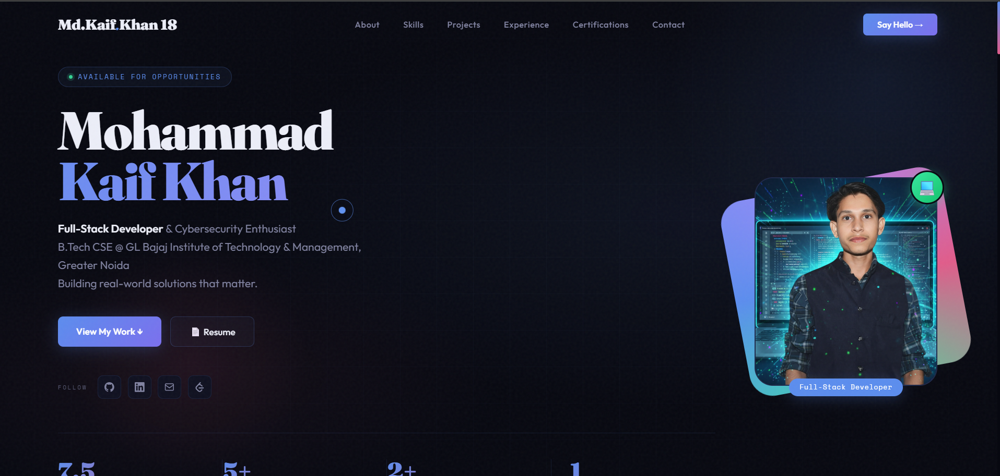
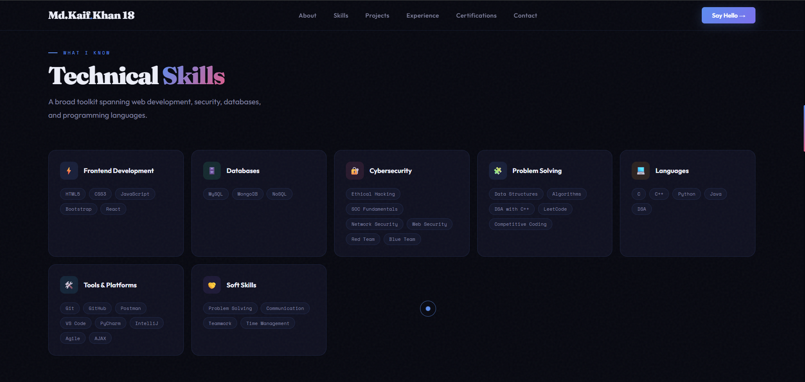

# 🚀 Mohammad Kaif Khan — Personal Portfolio

<div align="center">



[](https://md-kaif534.github.io/Portfolio-using-HTML-and-CSS/)
[](https://github.com/Md-Kaif534)
[](https://linkedin.com/in/md-kaif-khan-3530252a5/)
[](https://leetcode.com/u/Md_Kaif3392/)

</div>

---

## 👨‍💻 About This Portfolio

A modern, responsive personal portfolio website built with **HTML5**, **CSS3**, and **Vanilla JavaScript**. Showcasing my skills, projects, experience, and education as a Full-Stack Developer & Cybersecurity Enthusiast.

---

## ✨ Features

- 🎨 **Dark Theme** — Deep navy dark UI with gradient accents
- 💫 **Custom Cursor** — Animated cursor with smooth ring effect
- 📱 **Fully Responsive** — Works on all screen sizes
- 🔄 **Smooth Animations** — Scroll-triggered fade-up animations
- 🌟 **Hero Section** — Name, photo, stats & social links
- 🧠 **Skills Section** — Categorized tech stack with hover effects
- 💼 **Projects Section** — Featured ML & Web projects
- 🏢 **Experience Section** — Internship at Techpile Technology
- 🎓 **Education Timeline** — B.Tech, Diploma, Intermediate, High School
- 🏆 **Certifications** — Verified credentials from top platforms
- 📬 **Contact Form** — Reach out directly
- 🔗 **LeetCode Profile** — Linked in socials & contact section
- 🦶 **Professional Footer** — Multi-column with all links

---

## 🛠️ Tech Stack

| Technology | Usage |
|-----------|-------|
| HTML5 | Structure & Semantic Markup |
| CSS3 | Styling, Animations, Grid & Flexbox |
| JavaScript | Cursor, Scroll Effects, Form Handling |
| Google Fonts | Fraunces + Outfit Typography |
| Git & GitHub | Version Control & Hosting |

---

## 📸 Screenshots

### 🏠 Hero Section


### 👤 About & Education


### ⚡ Skills Section


---

## 📁 Project Structure

```
Portfolio-using-HTML-and-CSS/
│
├── index.html          # Main HTML file
├── style.css           # All styles
├── images/             # Screenshots & assets
│   ├── front_page.png
│   ├── about_page.png
│   └── skills_page.png
└── README.md           # You are here!
```

---

## 🚀 Getting Started

### View Locally

```bash
# 1. Clone the repository
git clone https://github.com/Md-Kaif534/Portfolio-using-HTML-and-CSS.git

# 2. Open the folder
cd Portfolio-using-HTML-and-CSS

# 3. Open index.html in browser
start index.html      # Windows
open index.html       # Mac
```

---

## 📬 Contact Me

| Platform | Link |
|---------|------|
| 📧 Email | mdkaifk534@gmail.com |
| 📱 Phone | +91-8604403392 |
| 💼 LinkedIn | [md-kaif-khan-3530252a5](https://linkedin.com/in/md-kaif-khan-3530252a5/) |
| 🐙 GitHub | [Md-Kaif534](https://github.com/Md-Kaif534) |
| 🟡 LeetCode | [Md_Kaif3392](https://leetcode.com/u/Md_Kaif3392/) |

---

## 🎓 Education

| Degree | Institution | Year | Score |
|--------|------------|------|-------|
| B.Tech CSE | GL Bajaj Institute, Greater Noida | 2024–2027 | 7.5 CGPA |
| Diploma CSE | Mahamaya IT Polytechnic, Maharajganj | 2022–2024 | 8.0 CGPA |
| Intermediate (XII) | Shri Gandhi Smarak Inter College, Kushinagar | 2021 | 82% |
| High School (X) | Jumman Khan HSS Bhatani Bujurg, Deoria | 2019 | 80% |

---

## 🏆 Certifications

- 🛡️ Cybersecurity Foundation — Palo Alto Networks
- 🔰 Cybersecurity Academy Orientation — Palo Alto Networks
- 🍃 Getting Started with MongoDB Atlas — MongoDB
- 🗣️ UNXT Soft Skill Development — SGBS Unnati Foundation
- ☁️ AWS Academy Graduate — Cloud Foundations

---

<div align="center">

**⭐ If you like this portfolio, please give it a star!**

Made with ❤️ by **Mohammad Kaif Khan** — Deoria, UP, India

</div>
